# Tool overview

This diagram maps the checked-in command entry points to the executable format
definitions, the other tools they invoke, and the artifacts they consume or
produce. Solid arrows are direct load, invocation, or data flows. Dashed arrows
are cross-tool validation and orchestration flows.

```mermaid
flowchart TB
  hdf5["HDF5 files"]:::artifact
  poke["GNU poke"]:::runtime

  subgraph format["Executable HDF5 format layer"]
    direction TB
    shared["pickles/<br/>common types, structures, checksums"]:::format
    construct["construct.pk<br/>in-memory builders"]:::format
    policy_pk["h5policy/pickles/<br/>bounded validators and consumer API"]:::format
    explain_pk["h5explain/pickles/<br/>navigation and explanations"]:::format
    patch_pk["h5patch/pickles/<br/>evidence-gated repair catalog"]:::format
    emacs_pk["hdf5_poke_emacs.pk<br/>structured inspector protocol"]:::format

    shared --> construct
    shared --> policy_pk
    shared --> explain_pk
    policy_pk --> patch_pk
    shared --> emacs_pk
  end

  subgraph primary["Primary inspection, policy, and repair tools"]
    direction LR
    markers["h5markers<br/>standalone C++ marker scanner"]:::tool
    policy["h5policy<br/>security preflight oracle"]:::tool
    explain["h5explain<br/>interactive byte-level explorer"]:::tool
    patch["h5patch<br/>plan, apply, and verify repairs"]:::tool
    emacs_ui["emacs/hdf5-poke.el<br/>interactive inspector UI"]:::tool
    cve["h5cve<br/>CVE case orchestration"]:::tool
    case_bundle["cases/&lt;id&gt;/<br/>provenance-stamped evidence bundle"]:::artifact
  end

  subgraph evidence["Corpus, differential, fuzzing, and measurement tools"]
    direction TB
    gencorpus["h5policy-gencorpus"]:::support
    corpus["h5policy/tests/<br/>fixtures and expectations"]:::artifact
    diff["h5policy-diff"]:::support
    fuzzlib["h5policy-fuzzlib<br/>shared mutation engine"]:::support
    fuzz["h5policy-fuzz"]:::support
    crashfuzz["h5policy-crashfuzz"]:::support
    mutate["h5mutate<br/>typed semantic variants"]:::support
    probe["h5policy-probe<br/>exact-build activation tracing"]:::support
    seam["h5policy-seamcheck<br/>batched-state isolation"]:::support
    truncate["h5policy-truncate<br/>prefix sweep"]:::support
    lazy["h5policy-lazy<br/>payload-laziness measurement"]:::support
    libhdf5["libhdf5, h5py, h5dump,<br/>h5debug, and installed HDF5 tools"]:::runtime

    gencorpus --> corpus
    corpus --> diff
    corpus --> fuzz
    corpus --> crashfuzz
    corpus --> seam
    corpus --> truncate
    fuzzlib --> fuzz
    fuzzlib --> crashfuzz
    fuzzlib --> seam
  end

  subgraph documentation["Documentation, registry, and automation"]
    direction LR
    sidecars["docs/spec/*.yml<br/>prose sidecars"]:::artifact
    pkdoc["pkdoc.py<br/>format-reference generator"]:::automation
    generated["docs/generated/*.md"]:::artifact
    registry["registry/<br/>findings, coverage, and measurements"]:::artifact
    finding_registry["finding_registry.py<br/>catalog loader and resolver"]:::automation
    registry_checks["check_registry.py and message_routing.py<br/>registry consistency gates"]:::automation
    doc_checks["check_tutorial.py and documentation checks<br/>executable documentation contracts"]:::automation
    cmake["CMake and CTest<br/>build, docs-check, and regressions"]:::automation

    sidecars --> pkdoc
    pkdoc --> generated
    registry --> finding_registry
    registry --> registry_checks
    cmake --> pkdoc
    cmake --> registry_checks
    cmake --> doc_checks
  end

  shared --> pkdoc
  policy_pk --> policy
  explain_pk --> explain
  patch_pk --> patch
  emacs_pk --> emacs_ui

  poke --> policy
  poke --> explain
  poke --> patch
  poke --> emacs_ui

  hdf5 --> markers
  hdf5 --> policy
  hdf5 --> explain
  hdf5 --> patch
  hdf5 --> emacs_ui
  hdf5 --> cve

  explain -. "check / check_all" .-> policy
  patch -. "evidence and post-apply verification" .-> policy
  cve -. "triage" .-> policy
  cve -. "marker census" .-> markers
  cve -. "navigation transcript" .-> explain
  cve -. "typed variants" .-> mutate
  cve -. "exact-build verification" .-> probe
  finding_registry --> cve
  cve --> case_bundle

  diff --> policy
  diff --> libhdf5
  fuzz --> policy
  fuzz --> libhdf5
  crashfuzz --> policy
  crashfuzz --> libhdf5
  mutate --> policy
  probe --> libhdf5
  seam --> policy
  truncate --> policy
  lazy --> policy
  truncate --> registry
  lazy --> registry

  cmake --> markers
  corpus --> cmake

  classDef format fill:#fff2b8,stroke:#9a7b18,color:#201b0b
  classDef tool fill:#e9e0f7,stroke:#7355a5,color:#201832
  classDef support fill:#dceefa,stroke:#37799e,color:#102832
  classDef automation fill:#dff3e4,stroke:#3d8150,color:#16331d
  classDef artifact fill:#f0f1f3,stroke:#747a82,color:#202428
  classDef runtime fill:#fde1d3,stroke:#a65e3c,color:#3c1d11

  style format fill:#fffaf0,stroke:#d2b85a
  style primary fill:#faf7ff,stroke:#aa92ce
  style evidence fill:#f4faff,stroke:#8dbbd3
  style documentation fill:#f5fbf6,stroke:#8ab596
```

The central dependency is the shared [`pickles/`](../pickles/) format layer.
`h5policy`, `h5explain`, `h5patch`, and the Emacs inspector add purpose-specific
overlays without duplicating the base HDF5 structures. `h5policy` is also the
shared evidence source: the explorer exposes it through `check`, the repair
workflow uses it to plan and verify changes, and the research tools compare or
stress its decisions.

[`h5cve`](../TOOLS.md#h5cve-case-orchestrator) composes those capabilities into
a case workflow. The remaining tools build the regression corpus, compare the
independent oracle with libhdf5, generate mutations, probe selected builds, and
record reproducible coverage measurements under [`registry/`](../registry/).
